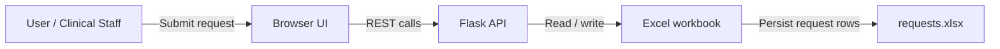

# Clinical Request Tracker

A simple, self-hosted clinical request workflow that turns manual request handling into a lightweight web-based process.

## What this project is

This project is a small request-tracking prototype for clinical teams who need a low-friction way to capture requests, monitor status, and keep an audit-friendly record in a familiar Excel format.

It is designed to sit between manual spreadsheets and heavyweight enterprise systems.

## Why it exists

Many healthcare teams still use scattered email, paper forms, or shared spreadsheets for service and IT requests.

This project offers a minimal alternative that:

* avoids complex licensing and cloud lock-in
* keeps data in a simple Excel workbook for easy review
* uses a browser-based interface for quick adoption
* supports basic request lifecycle updates without heavy infrastructure

## What makes it different

Compared to standard market solutions like full ticketing systems or Power Platform prototypes, this app is meant for rapid experimentation and local hosting.

Key differences:

* No database required — data is stored directly in Excel
* No complex integrations required — the frontend talks to a small Flask API
* Faster to adapt than enterprise ticket systems
* Easier for small teams than building a custom SharePoint/Dataverse app

## What it changes from the current market

Instead of requiring a large platform, this project provides:

* a transparent workflow layer over Excel
* direct control over request status and deletion
* a simple HTML/CSS/JS UI rather than a fully managed SaaS experience
* a lightweight prototype that can be extended into a more formal system later

## Architecture overview

## High-level flow

1. A user enters request details in the browser.
2. The browser sends the request to the backend API.
3. The API saves request rows into an Excel workbook.
4. The browser can retrieve requests and update their statuses.
5. Request status changes are written back to the same workbook.

## Value proposition

This project is useful when you want:

* a quick clinical request tracker without a full ticketing platform
* an app that can be reviewed by staff familiar with Excel
* a prototype to validate workflow before investing in a larger system
* a foundation that can be extended into more capable solutions later
* a simple ticket model that supports comments on each request

## What it is not

This is not a full enterprise service desk.

It is intentionally simple and best suited for small teams, proof-of-concept use, or internal process experimentation.

---

## Quick summary

* **Purpose:** Simplify clinical request intake and status tracking
* **Primary benefit:** Lightweight, Excel-backed, self-hosted prototype
* **Differentiator:** Simple workflow layer with minimal infrastructure
* **Best fit:** Small teams, rapid proof-of-concept, legacy or spreadsheet-driven environments
